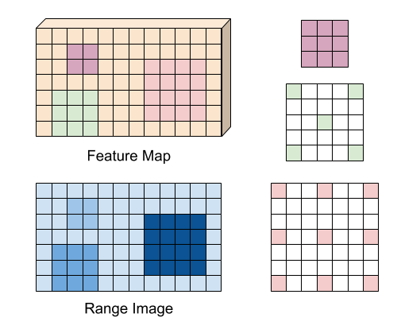

# Dynamic Dilation Layer for Pytorch
Custom pytorch layer to promote learing of scale invariant features.

The Layer applies the same convolution kernels using different dilation factors, depending on the location within the image for which a corresponding range measurement is available. Locations with measurements corresponding to close ranges apply the kernel using a high dilation, far away locations with lower dilations.

